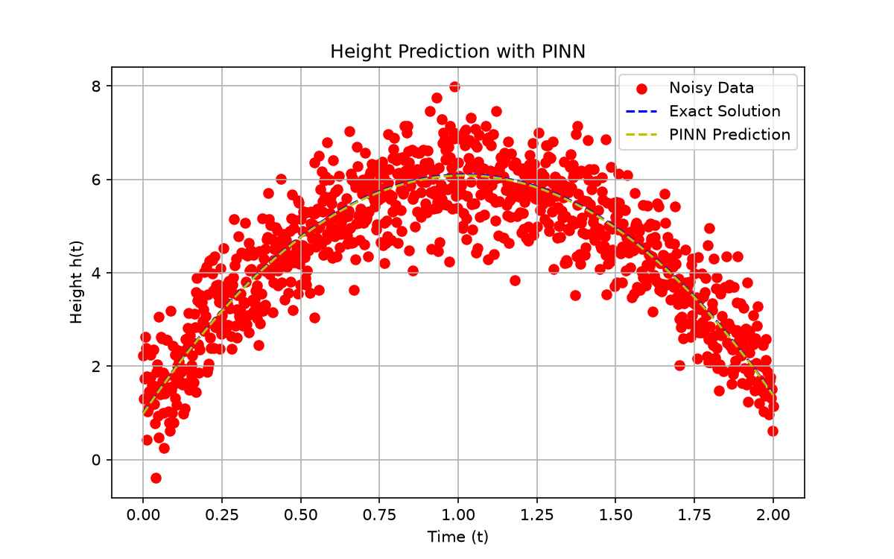

# PINN for Projectile Height

Physics-informed neural network that learns h(t) = h0 + v0*t - 0.5*g*t^2
from 1000 noisy measurements, using the ODE dh/dt = v0 - g*t and the
initial condition h(0) = h0.

## Setup
pip install -r requirements.txt

## Usage
python train.py     # trains and saves model/
python predict.py   # predicts height at t = 1.5 s

## Result
